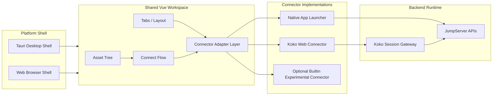

# JumpServer Workspace Unified Design

## Background

The desktop client currently mixes three kinds of responsibilities:

- workspace UI: asset tree, tabs, connection entry, status display
- platform shell: Tauri windowing, local app launch, native dialogs
- protocol runtime: built-in SSH bridge and future potential database protocol bridges

At the same time:

- `koko` already provides protocol proxy, websocket terminal, ACL, auditing, and multi-protocol session handling
- `luna` already provides a web workspace model based on asset tree plus tabbed connectors
- the desktop client is growing toward the same product shape as `luna`

If we continue embedding protocol libraries directly into the client for SSH, MySQL, PostgreSQL, Redis, and others, the client will become larger, harder to maintain, and will drift from the web terminal behavior.

This document defines a unification plan: protocol handling converges into `koko`, while desktop and web converge into one shared Vue workspace.

> Current implementation note: iframe-based session surfaces have been removed
> from the shared workspace. Later references to embedding describe historical
> migration options, not requirements for pane layout or session lifecycle.

## Goals

- stop expanding desktop-native protocol implementations beyond narrow platform-specific needs
- make `koko` the default runtime for terminal and database session protocols
- converge desktop and web onto one shared workspace UI implementation
- preserve the desktop shell advantages: local app launch, system integration, native packaging
- reduce duplicate logic across `clients`, `luna`, and `koko`

## UI Rules

- dropdown, popover, and modal typography should stay aligned with the page's primary text size instead of appearing larger than the surrounding UI
- menus should prefer compact vertical spacing by default so utility operations feel lightweight and scan quickly
- toolbar overflow actions should sit adjacent to the control they extend; for example, a section-management `...` belongs next to search when it configures the same header area
- theme implementation should follow a three-layer model: preset seed tokens, semantic app tokens, and component consumption
- Nuxt UI based screens should consume Nuxt UI components first and avoid custom theme branching unless a component is not expressive enough
- custom connector/workspace UIs must not infer colors from `primary` or a single background color; they should only consume semantic tokens such as surface, text, border, hover, selected, and focus

## Theme System

The shared workspace should use one theme pipeline for desktop shell UI and connector workspaces.

### Layer 1: preset seed tokens

Theme presets define only the small set of seed tokens:

- `--theme-bg`
- `--theme-fg`
- `--theme-muted`
- `--theme-border`
- `--theme-accent`
- `--theme-surface`
- `--theme-surface-hover`
- `--theme-shadow-soft`

This is the only layer that should vary between presets such as Catppuccin, Gemini, Luna, or future brand skins.

### Layer 2: semantic app tokens

Global CSS derives semantic tokens from the seeds, for example:

- text: primary, secondary, muted, inverse
- surfaces: canvas, sidebar, panel, header, footer, input, card, overlay
- interaction: hover, selected, focus ring
- borders: subtle, strong

Connector authors should treat these semantic tokens as the stable contract.

Additional domain tokens should be defined on top of the semantic layer:

- `editor.*` for CodeMirror 6, SQL Editor, diff editor, and future `chen` editor surfaces
- `syntax.*` for code highlighting shared by file editing and SQL editing
- `terminal.*` for xterm-based surfaces
- `dataGrid.*` for SQL results, schema tables, and tabular inspectors
- `workspace.*` for connector-owned shells such as file manager, k8s UI, or future multi-pane tools

### Layer 3: component consumption

- Nuxt UI components should pick up the theme through global UI variables and app config overrides.
- bespoke widgets such as xterm, CodeMirror, iframe shells, and file trees should read semantic tokens only.
- workspace code should never hardcode white/black backgrounds for protocol surfaces unless the protocol runtime requires it and the value is still derived from semantic tokens.

### Zed Compatibility

We should treat Zed as an inspiration and an import target, not as the sole source of truth.

- our schema should remain domain-oriented around shared UI, editors, terminals, tables, and workspaces
- Zed themes can be imported into a compatible subset by mapping Zed theme fields into our `seed`, `editor`, `syntax`, and `terminal` domains
- unsupported Zed-only fields such as product-specific chrome or unsupported syntax scopes may be ignored during import
- custom product-specific domains such as `workspace.*` or future connector-specific panels remain first-class in our schema

## Non-Goals

- rewrite all of `koko` frontend pages in one step
- replace every existing Luna feature before starting migration
- remove native external application launch support
- unify every product frontend into one repo immediately

## Current State Summary

### Clients

- built with Tauri + Vue/Nuxt
- already has asset tree and tabbed workspace behavior
- recently introduced a built-in SSH path using `xterm.js` plus a Rust SSH bridge
- plugin system is being introduced for external applications

### Koko

- already exposes authenticated web routes such as `/koko/connect/`
- already exposes websocket terminal endpoints under `/koko/ws/terminal`
- already contains multi-protocol server connection code in `pkg/srvconn`
- already owns session policy, ACL, auditing, and protocol-specific runtime behavior

### Luna

- built with Angular
- already models the product as a workspace shell with left asset tree and right tab area
- already uses iframe-based connector loading for web terminal and other connector pages

## Direction

### Strategic Choice

Use `koko` as the session and protocol gateway.

Build a shared Vue workspace that can run in:

- desktop: inside the Tauri shell
- web: as the browser workspace replacing Luna incrementally

Keep native local-app launch as a platform adapter, not as the main connection implementation.

## Target Architecture



## Core Architectural Decisions

### 1. Koko becomes the default connector runtime

Default protocols should run through `koko` whenever possible:

- SSH
- Telnet
- database protocols such as MySQL, PostgreSQL, Redis, MongoDB, Oracle, SQL Server
- Kubernetes terminal-style sessions
- SFTP and similar web-managed sessions when supported

Benefits:

- one place for protocol maintenance
- consistent ACL and audit behavior with web
- less client binary growth
- fewer per-platform protocol bugs

### 2. Desktop becomes a shell, not a protocol host

The desktop app should focus on:

- authentication bootstrap
- workspace rendering
- local app launching
- OS integration
- settings, notifications, storage

It should not become the long-term home for protocol client stacks.

### 3. Shared Vue workspace replaces duplicated shells

The asset tree, tabs, connect dialog, workspace status, and view lifecycle should exist once in a shared Vue implementation.

This shared workspace should replace:

- the new duplicated workspace logic in `clients`
- the Angular workspace shell in `luna`

### 4. Workspace session surfaces do not rely on iframe

The shared workspace session path uses native Vue connector surfaces. Split-pane
drag and drop, layout changes, and session lifecycle preservation assume that
surfaces live in the same Vue document.

Iframe-specific drag overlays, hit testing, and lifecycle workarounds are outside
the workspace design. If external web content is introduced again, its connector
adapter must own that boundary without adding iframe branches to shared pane
layout code.

## Performance Position

Native Vue connector surfaces avoid an extra document boundary. Their dominant
latency is usually:

- user input event handling
- websocket round-trip
- remote target response
- terminal rendering

The practical workspace integration issues are:

- focus handoff
- keyboard shortcut routing
- copy/paste behavior
- drag/drop and upload
- theme synchronization
- tab title/status synchronization
- session close and reconnect signaling

Pane moves and layout changes must preserve the mounted connector instance so
they do not close sockets, clear terminal state, or reconnect a session.

## Authentication And Session Bootstrap

This is a key design point.

Current `koko/connect` routes are authenticated by session middleware. Relying on browser cookies alone is fragile for desktop embedding.

We should introduce a controlled bootstrap model for embedded connectors.

### Required capability

The desktop and future shared web workspace need a stable way to open a `koko` connector view using an explicit short-lived authorization mechanism.

### Recommended model

1. User authenticates in the shell application.
2. Workspace requests a short-lived embed authorization from JumpServer.
3. Shell opens the `koko` connector URL with that authorization.
4. `koko` validates the authorization and establishes session state for the connector page and websocket.

### Why

- avoids hidden cookie coupling
- improves desktop reliability
- makes connector embedding more portable
- makes future web/desktop sharing cleaner

### API note

Exact token form can be decided later, but it should be:

- short-lived
- scoped to user and target connection context
- usable by both HTTP page bootstrap and websocket upgrade
- auditable

## Confirmed Decision: Koko Must Support Client API Authentication

We have validated that embedding `koko` inside the desktop client through an iframe or webview is feasible from a UI perspective, but the current authentication model blocks the desktop flow.

Current behavior:

- `koko` HTTP middleware only checks browser cookies
- unauthenticated requests are redirected with HTTP `302`
- desktop client currently authenticates backend API calls with bearer token plus org context, not with browser cookie state

This means the desktop client should not continue depending on cookie synchronization hacks for embedded `koko`.

### Decision

`koko` must support the same authenticated client session model already used by the desktop client for backend API access.

For embedded desktop access, `koko` authentication should support:

1. existing cookie-based web authentication for browser compatibility
2. bearer-based client authentication for desktop embedding

### Middleware priority

Recommended authentication order inside `koko`:

1. try existing cookie-based authentication
2. if cookie authentication is absent or invalid, try `Authorization: Bearer ...`
3. validate bearer token against core
4. resolve user and org context
5. continue using the same user/session context as normal web requests

### Why

- avoids hidden dependency on browser cookie storage
- avoids coupling desktop embedding to Luna dev proxy behavior
- aligns `koko` with the desktop client's existing API authentication model
- gives a cleaner base for future explicit embed auth

### Important constraint

`koko` should not trust bearer strings locally without validation.

It must validate the incoming bearer token with core before treating the request as authenticated.

### Affected Koko surfaces

This support must cover both:

- HTTP page routes such as `/koko/connect/`
- websocket routes such as `/koko/ws/terminal/`

### Desktop-side implication

Once `koko` supports bearer-based authentication:

- desktop can embed `koko` without requiring cookie injection
- iframe/webview requests must attach bearer and org context explicitly
- later optimization can move from iframe reuse to a lighter connector shell without changing the authentication model

## Workspace Layering

We should split the future shared workspace into three layers.

### `workspace-core`

Shared domain and orchestration logic:

- asset and protocol models
- connection session models
- tab lifecycle
- organization and site context
- permission-aware connection flow
- event contracts between workspace and connector adapters

### `workspace-ui-vue`

Shared Vue UI implementation:

- asset sidebar
- search and filters
- tabs and split layout
- connection dialog
- empty states and status toasts
- top workspace chrome

### `connector-adapters`

Connector runtime abstraction:

- `koko-web-adapter`
- `native-app-adapter`
- `builtin-terminal-adapter` as experimental or fallback only

Suggested connector adapter interface:

```ts
export interface WorkspaceConnectorAdapter {
  kind: "koko-web" | "native-app" | "builtin-terminal"
  supports: (protocol: string, connectMethod: string) => boolean
  open: (session: WorkspaceSession) => Promise<WorkspaceViewHandle>
  focus: (viewId: string) => void
  resize: (viewId: string, rect: { width: number, height: number }) => void
  close: (viewId: string) => Promise<void>
}
```

### Connector Capability Declaration

To keep future workspace growth maintainable, every connector component should declare its supported:

- component identity
- protocols
- connect methods
- workspace surfaces

This declaration should be a source of truth consumed by:

- connect method normalization and presentation
- workspace surface routing
- default method selection
- future capability inspection or admin diagnostics

Example declaration shape:

```ts
export interface WorkspaceCapabilityDeclaration {
  component: "koko" | "chen" | "lion" | "tinker"
  surface: "terminal" | "file-manager" | "file-editor" | "k8s-ui"
  protocols: string[]
  connectMethods: string[]
  backendConnectMethod?: string
}
```

Current known `koko` declarations:

- built-in terminal: `ssh`, `telnet`, `mysql`, `mariadb`, `postgresql`, `redis`, `mongodb`, `oracle`, `sqlserver`
- file manager: `sftp`
- file editor: `sftp`
- Kubernetes UI: `k8s`

Rule of thumb:

1. Protocol support belongs to the component declaration, not scattered `if/else`.
2. A connect method is a user-visible entry choice.
3. A workspace surface is the actual UI/runtime implementation opened by that choice.
4. Multiple workspace surfaces may share one backend connect method, such as SFTP file manager and file editor.

### Workspace Directory Convention

To make component-owned workspaces obvious and maintainable, each connector component should keep its workspace implementations in a dedicated `workspaces/` directory under its own module root.

Examples:

- `ui/koko/workspaces/`
- `ui/chen/workspaces/`
- `ui/lion/workspaces/`

Current `koko` workspace files should stay explicit and one-to-one with the user-visible workspace types:

- `ui/koko/workspaces/TerminalSessionSurface.vue`
- `ui/koko/workspaces/FileManagerSessionSurface.vue`
- `ui/koko/workspaces/FileEditorSessionSurface.vue`
- `ui/koko/workspaces/KubernetesWorkspace.vue`

Shared base abstractions are encouraged so workspace implementations do not duplicate session bootstrap logic.

Recommended pattern:

- keep one file per user-visible workspace
- extract shared session bootstrap into a base composable such as `useBaseWorkspaceSession`
- extract shared ready/loading/error shell into a base component such as `BaseWorkspaceShell`
- let component-specific workspaces compose or extend those base pieces instead of reimplementing endpoint lookup, ticket exchange, theme sync, and common state handling

This pattern should apply not only to `koko`, but also to future component modules such as `chen` and `lion`.

Rules:

1. All workspace UI implementations for a component should live in that component's `workspaces/` directory.
2. Cross-component routing code may import from those directories, but should not redefine the implementations elsewhere.
3. New workspace types should be added there first, then declared in the component capability registry.
4. Common workspace behavior should be abstracted into reusable base capabilities when multiple workspaces share the same lifecycle.
5. This keeps protocol declaration, connection method mapping, and workspace implementation organization aligned.

## Migration Plan

### Phase 0: Alignment And Guardrails

Status:

- document the target architecture
- stop adding new first-class built-in protocol stacks without explicit exception
- keep current built-in SSH path as temporary and experimental

Deliverables:

- this design document
- architecture decision communicated across `clients`, `koko`, and `luna`

### Phase 1: Desktop Koko Connector

Goal:

Introduce a new connector path in the desktop client that opens `koko` connector views instead of the Rust SSH bridge.

Scope:

- add `koko-web` connector adapter
- open `koko/connect` views in the right-side workspace
- pass asset/session context through the new adapter flow
- synchronize tab close, focus, title, and terminal-ready events
- preserve current native-app launch path for external apps

Deliverables:

- SSH can run through `koko` in desktop
- current built-in SSH is no longer the default

Exit criteria:

- desktop SSH via `koko` reaches acceptable usability
- no new desktop-native protocol bridge work is started for databases

### Phase 2: Authentication Bootstrap Hardening

Goal:

Replace implicit cookie dependence with a desktop-compatible authenticated embed mechanism.

Scope:

- add bearer-compatible authentication support to `koko`
- support desktop bootstrap and websocket authentication without relying on browser cookie state
- optionally evolve later into a short-lived embed authorization contract
- support future browser workspace use

Deliverables:

- desktop connector loading does not depend on manually synchronized cookie state
- connector boot is observable and debuggable

Exit criteria:

- connector auth failures can be traced clearly
- same mechanism works in desktop and browser shells

### Phase 3: Shared Vue Workspace Extraction

Goal:

Make the current desktop workspace implementation reusable outside Tauri.

Scope:

- extract workspace domain model
- extract reusable Vue UI modules
- isolate Tauri-only code behind platform service interfaces

Deliverables:

- shared workspace packages or workspace modules
- desktop app consumes the shared modules

Exit criteria:

- asset tree, tabs, and connect flow no longer depend directly on Tauri APIs

### Phase 4: Luna Replacement By Feature Slice

Goal:

Incrementally replace Luna's Angular shell with the shared Vue workspace.

Scope:

- first replace the main asset-tree plus tabbed workspace shell
- keep existing connector pages if needed during transition
- migrate per-feature rather than all-at-once

Suggested migration order:

1. asset tree and navigation shell
2. tab workspace and view lifecycle
3. connect dialog and connect method selection
4. session tabs using `koko-web` adapter
5. remaining Luna-only integrations

Deliverables:

- Vue workspace runs in browser
- Angular Luna surface starts shrinking instead of growing

Exit criteria:

- core workspace path no longer requires Angular

### Phase 5: Protocolized Connector Reuse

Goal:

Move from page-level iframe reuse toward a more reusable connector contract where justified.

Scope:

- evaluate whether `koko` frontend logic should expose a reusable frontend SDK or more structured embed contract
- only do this after Phases 1 to 4 are stable

Deliverables:

- cleaner connector integration where needed
- reduced iframe boundary friction over time

## Module Impact

### `clients`

Will own:

- Tauri shell
- local app launching
- platform integrations
- shared Vue workspace consumption

Will reduce ownership of:

- built-in protocol runtimes
- protocol-specific terminal behavior

### `koko`

Will own:

- session bootstrap
- websocket terminal runtime
- protocol adapters
- policy and audit behavior
- reusable embedded connector contract

Needs enhancement in:

- embed-friendly auth bootstrap
- desktop/webview integration hooks
- postMessage or host bridge contract if iframe embedding continues

### `luna`

Will move toward:

- consumer or host of the shared Vue workspace
- eventual retirement of duplicated Angular workspace shell

Will gradually reduce:

- duplicated tabbed workspace implementation
- duplicated connection shell behavior

## Risks

### Risk: Embedded connector UX feels less native

Mitigation:

- treat embedded focus and keyboard handling as first-class integration work
- keep native app launch for protocols or workflows where embedded UX is not ideal

### Risk: Cookie and auth handling is brittle

Mitigation:

- prioritize explicit embed bootstrap in Phase 2
- avoid long-term reliance on ambient browser cookie state

### Risk: Migration stalls because Luna and clients diverge further

Mitigation:

- freeze major new workspace features in duplicated shells where possible
- build new workspace features in shared Vue modules only

### Risk: Koko pages are reused forever without cleaner contracts

Mitigation:

- accept page embedding only as a transition step
- revisit structured connector contracts after shared workspace unification

## Decision Rules

When adding or changing connection features:

1. If `koko` can own the runtime, prefer `koko`.
2. If the feature is UI shell behavior, build it in the shared Vue workspace.
3. If the feature is OS-specific, build it in the desktop shell adapter.
4. Only add built-in protocol runtime inside `clients` with explicit justification.

## Immediate Execution Plan

### Milestone A: Desktop SSH through Koko

Tasks:

- add a `koko-web` connection adapter in `clients`
- wire workspace tabs to host a connector WebView or iframe-like container
- route SSH built-in connect flow to the `koko-web` adapter by default
- keep current Rust SSH bridge behind a feature flag or fallback path

### Milestone B: Desktop Connector Auth Bootstrap

Tasks:

- add bearer-aware auth middleware support in `koko`
- define the desktop-to-`koko` request contract
- pass org context together with authenticated desktop requests
- make websocket authentication work under the same model

Suggested Koko work items:

- extend `HTTPMiddleSessionAuth` to support bearer fallback after cookie check
- add the same fallback logic for websocket authentication entry points
- validate bearer token through core before creating request user context
- ensure org context is honored consistently with desktop API session behavior

Suggested desktop work items:

- define how embedded requests attach bearer credentials
- define how org context is attached to embedded requests
- keep the current iframe experiment only as a temporary harness until bearer auth lands in `koko`

### Milestone C: Shared Workspace Extraction

Tasks:

- identify Tauri-bound code in the current Vue workspace
- extract pure workspace state and tab logic
- define platform services for shell-only features

### Milestone D: Web Workspace Pilot

Tasks:

- mount the shared Vue workspace in a browser target
- run one end-to-end asset-to-SSH connection flow
- validate parity expectations against Luna

## Open Questions

- should the shared workspace live in this repo first, or in a new shared workspace repo
- should desktop embed `koko` through a standard webview route, or through a more specialized internal browser component
- should `koko` expose postMessage hooks for host control, or should the host rely only on URL plus websocket behavior
- what is the minimum viable embed auth contract for Phase 2
- which Luna features are truly core for first migration, and which can wait

## Recommended Next Step

Start with Milestone A.

That gives the team the fastest architectural leverage:

- immediate reuse of `koko`
- no further database protocol pressure on the desktop client
- a practical base for shared workspace evolution
