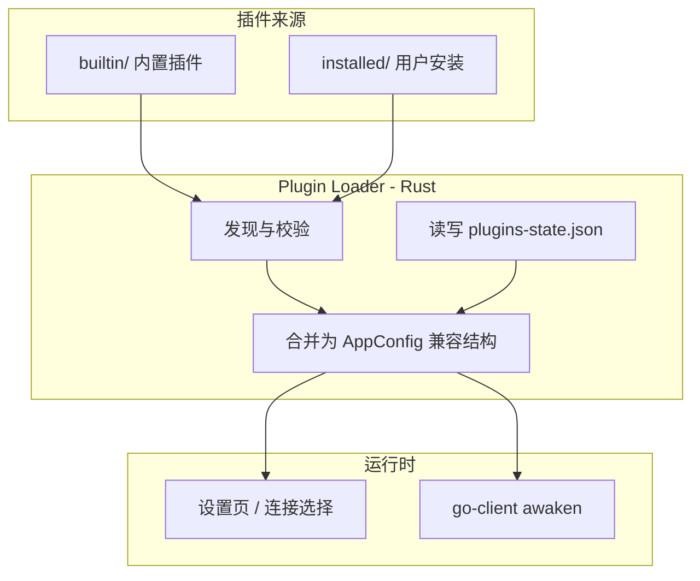
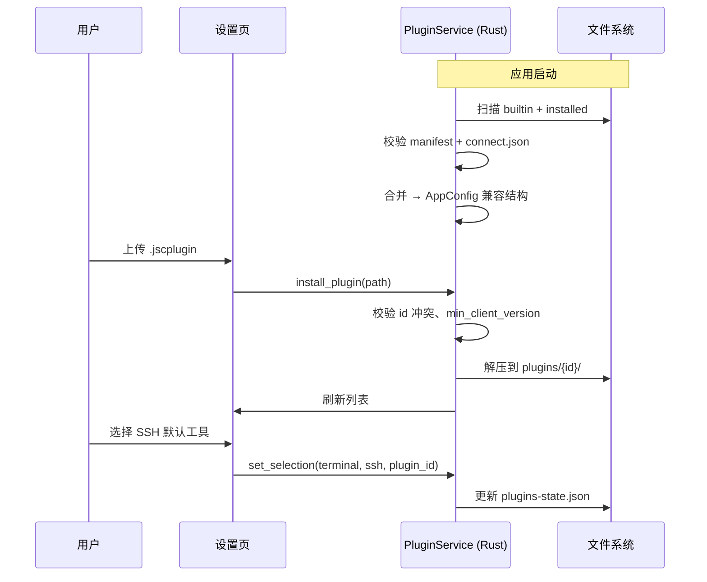

# JumpServer Client 连接插件机制设计

## 背景与目标

当前客户端通过单体 `config.json` 定义各协议的外部连接工具（终端、远程桌面、文件传输、数据库等）。随着支持的工具增多，存在以下问题：

- 单体 JSON 难以维护、合并冲突频繁
- 平台差异逻辑散落在 `awaken_*.go` 与配置中（如 Navicat URL、iTerm AppleScript、AutoIt）
- 新增工具需改主仓库并发版，第三方无法独立扩展
- UI 图标与工具名硬编码在 Vue 组件中

**目标**：将每种连接工具拆为独立**插件包**，内置常用插件，其余支持上传安装。

---

## 核心概念

| 概念 | 说明 |
|------|------|
| **插件 (Plugin)** | 一个独立目录或 `.jscplugin` 包，描述一种外部连接工具 |
| **内置插件 (builtin)** | 随安装包分发，位于 `resources/plugins/builtin/` |
| **用户插件 (installed)** | 用户安装，位于 `{config_dir}/jumpserver-client/plugins/` |
| **清单 (manifest)** | 插件元数据：id、版本、作者、支持协议等 |
| **连接定义 (connect)** | 各平台如何启动外部程序 |
| **用户状态 (state)** | 用户选择、自定义路径等，与插件包分离 |

---

## 架构总览



### 数据流

1. **启动时**：`PluginService` 扫描 builtin + installed，校验 manifest，合并为现有 `AppConfigType` 结构（**向后兼容**）。
2. **设置页**：展示所有可用插件；用户切换默认工具、配置 exe 路径 → 写入 `plugins-state.json`。
3. **连接时**：`awaken` 仍读取合并后的配置，按 `launch.type` 执行启动逻辑。

---

## 目录布局

```
jumpserver-client/                 # 用户配置目录
├── config.json                    # 逐步瘦身：仅保留窗口/UI 全局设置
├── plugins-state.json             # 用户插件偏好（替代 match_first / path / is_set）
└── plugins/
    └── {plugin_id}/               # 用户安装的插件（解压后的目录）

resources/                         # 安装包内
└── plugins/
    └── builtin/
        ├── putty/
        ├── mstsc/
        └── ...
```

仓库开发目录：

```
plugins/
├── schema/
│   └── manifest.schema.json
├── builtin/                       # 内置插件源码（构建时复制到 resources）
├── demo/                          # 第三方开发示例
└── tools/
    └── pack.sh                    # 打包 .jscplugin
```

---

## 插件包结构

每个插件是一个目录，打包为 `{id}-{version}.jscplugin`（ZIP，扩展名自定义）。

```
my-terminal-plugin/
├── manifest.json          # 必填：元数据
├── icon.png               # 必填：128×128，设置页展示
├── connect.json           # 必填：连接定义
├── README.md              # 可选：说明文档
└── scripts/               # 可选：复杂启动脚本
    ├── launch.windows.ps1
    ├── launch.macos.sh
    ├── launch.macos.applescript
    └── launch.linux.sh
```

### manifest.json

```json
{
  "id": "com.example.xshell",
  "name": "xshell",
  "display_name": "XShell",
  "version": "1.0.0",
  "min_client_version": "4.0.0",
  "author": "Example Corp",
  "homepage": "https://www.xshell.com",
  "download_url": "https://www.xshell.com/zh/xshell-download/",
  "category": "terminal",
  "protocols": ["ssh", "telnet"],
  "builtin": false,
  "comment": {
    "zh": "支持 SSH、TELNET 的终端模拟器。",
    "en": "Terminal emulator supporting SSH and TELNET."
  }
}
```

| 字段 | 必填 | 说明 |
|------|------|------|
| `id` | ✓ | 全局唯一，反向域名，安装后作为目录名 |
| `name` | ✓ | 短名，用于图标回退与日志 |
| `display_name` | ✓ | UI 展示名 |
| `version` | ✓ | 语义化版本 |
| `min_client_version` | ✓ | 最低客户端版本 |
| `category` | ✓ | `terminal` \| `remotedesktop` \| `filetransfer` \| `databases` |
| `protocols` | ✓ | 支持的协议列表 |
| `builtin` | | `true` 表示内置，不可卸载 |

### connect.json

按平台描述如何启动。`launch.type` 决定执行器：

| type | 说明 | 典型场景 |
|------|------|----------|
| `args` | 模板替换后作为命令行参数 | PuTTY、DBeaver |
| `script` | 执行 `scripts/` 下平台脚本，传入 JSON 上下文 | iTerm2、复杂 GUI 自动化 |
| `url` | 构建 URL Scheme 并 `open` | Navicat |
| `file` | 先写临时文件再打开 | RDP `.rdp` |
| `autoit` | Windows AutoIt 步骤序列（兼容现有配置） | Navicat 填表 |
| `system` | 调用 OS 内置能力 | macOS `open` RDP 文件 |

**模板变量**（与现 `arg_format` 一致）：

| 变量 | 说明 |
|------|------|
| `{name}` | 连接会话名（已转义） |
| `{protocol}` | 协议名 |
| `{username}` | 账号（SSH 类会加 `JMS-` 前缀） |
| `{value}` | 密码/Token |
| `{host}` | 主机地址 |
| `{port}` | 端口 |
| `{file}` | 临时文件路径（`file` 类型） |
| `{dbname}` | 数据库名 |
| `{use_ssl}` | 是否 SSL |
| `{allow_invalid_cert}` | 是否允许无效证书 |

示例见 `plugins/demo/hello-terminal/connect.json`。

### plugins-state.json（用户状态，非插件包内）

```json
{
  "version": 1,
  "selections": {
    "terminal:ssh": "builtin.putty",
    "databases:mysql": "builtin.dbeaver"
  },
  "plugins": {
    "com.example.xshell": {
      "enabled": true,
      "path": "C:\\Program Files\\NetSarang\\Xshell 8\\Xshell.exe"
    }
  }
}
```

- `selections`：每个 `category:protocol` 当前选用的插件 `id`（替代 `match_first`）
- `plugins[id].path`：用户自定义可执行文件路径（替代 config 中的 `path`）
- `plugins[id].enabled`：是否启用（可禁用已安装插件）

---

## 插件生命周期



### 安装规则

1. 解压到 `{config_dir}/plugins/{manifest.id}/`
2. `id` 与内置插件冲突 → 拒绝（内置优先）
3. 同 `id` 已存在 → 版本更高则覆盖，更低则拒绝
4. 可选：校验 ZIP 内 `SIGNATURE`（后续版本）

### 卸载规则

- 仅 `builtin: false` 可卸载
- 卸载时若该插件为某协议默认，回退到同协议第一个可用内置插件

---

## 与现有代码的迁移策略

### 阶段 1：插件化配置（兼容模式）

- 将 `config.json` 中各 `AppItem` 拆为 `plugins/builtin/{name}/`
- 新增 `PluginService`（Rust），启动时合并为现有 `AppConfigType`
- `get_config` / `update_config_selection` 改为读写 `plugins-state.json`
- **前端与 go-client 无需大改**

### 阶段 2：启动器插件化

- `awaken` 增加 `launch.type` 分发：`script` / `url` / `file`
- 将 Navicat、iTerm 等特殊逻辑迁入对应插件 `scripts/`
- 减少 `awaken_windows.go` 中的硬编码

### 阶段 3：插件市场（可选）

- JumpServer 服务端分发 `.jscplugin`
- 企业管理员推送插件策略

### config.json 瘦身

保留：

```json
{
  "filename": "Jumpserver Clients Config",
  "version": 9,
  "windowBounds": { "width": 1280, "height": 800 },
  "defaultSetting": { "theme": "light", "layout": "list", "language": "en" }
}
```

移除 `windows` / `macos` / `linux` 下的应用列表（迁至插件）。

---

## API 设计（Tauri Commands）

| Command | 说明 |
|---------|------|
| `list_plugins` | 列出所有插件（builtin + installed）及状态 |
| `get_config` | 返回合并后的 `AppConfigType`（兼容现有前端） |
| `install_plugin` | 安装 `.jscplugin` 包 |
| `uninstall_plugin` | 卸载用户插件 |
| `update_config_selection` | 设置协议默认插件 / 自定义路径（兼容现有签名） |
| `export_plugin_template` | 导出空白模板 ZIP（开发者工具） |

---

## 安全考量

1. **脚本执行**：`script` 类型仅执行插件目录内 `scripts/`，禁止 `..` 路径
2. **安装来源**：首版仅支持本地文件选择；后续可加签名验证
3. **权限声明**：manifest 可增加 `permissions: ["exec", "write_temp_file"]` 供审核
4. **沙箱**：脚本通过环境变量 `JMS_CONNECT_JSON` 传参，不拼接 shell 字符串

---

## 插件包格式 (.jscplugin)

- ZIP 压缩，UTF-8 文件名
- 根目录直接包含 `manifest.json`（不含额外顶层文件夹）
- 推荐命名：`{id}@{version}.jscplugin`，例如 `com.example.xshell@1.0.0.jscplugin`

打包：

```bash
./plugins/tools/pack.sh plugins/demo/hello-terminal
```

---

## 内置插件建议清单

| 平台 | category | 建议内置 |
|------|----------|----------|
| Windows | terminal | putty |
| Windows | remotedesktop | mstsc |
| Windows | filetransfer | winscp（可选） |
| macOS | terminal | terminal, iterm |
| macOS | remotedesktop | 系统 RDP（open） |
| Linux | terminal | 系统 terminal |
| Linux | remotedesktop | xfreerdp, tigervnc |
| 全平台 | databases | dbeaver（需用户配路径） |

其余（XShell、Navicat、MobaXterm 等）以**可选插件**形式提供下载或用户自行打包安装。
