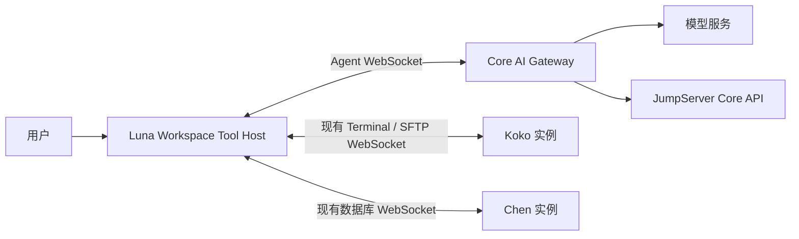
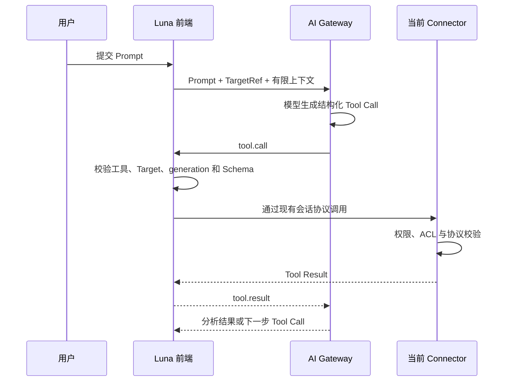

# Luna Workspace AI 架构设计

## 文档状态

- 状态：方案确认
- 适用范围：Luna Web 与 Electron Workspace
- 覆盖场景：Terminal、Scripts、SFTP/File Editor、Chen 数据库工作台
- 核心定位：用户在线操作期间的 Workspace Copilot

## 背景

Luna Workspace 同时承载 Terminal、脚本编辑、SFTP 文件管理与编辑、数据库工作台等多种连接器界面。我们希望 AI 成为 Workspace 的原生能力，让用户能够在 Chat 中完成解释、生成、修改、执行和工作台操作，而不是在每个 Connector 内各自实现一套 AI。

当前系统具有以下架构约束：

- 一个 JumpServer Core 对应多个 Koko、Chen 等 Connector 实例。
- Connector 可以主动连接 Core，但 Core 不一定能够主动访问 Connector。
- 用户会话具有状态，同一个资产的不同会话可能位于不同 Connector 实例。
- 前端已经持有当前会话实际使用的 Terminal、SFTP 或数据库 WebSocket。
- Web 与 Electron 共用 Workspace UI，前端不能被当作权限边界。
- Koko、Chen 继续负责协议、权限、ACL、执行与审计，前端不重新实现协议运行时。

## 结论

第一阶段采用以下架构：

> **AI Gateway 不直接连接 Koko、Chen。前端作为 Workspace Tool Host，通过现有会话连接调用当前 Connector。**

AI Gateway 负责模型、对话和 Agent 推理；前端负责当前工作台上下文、UI 工具和工具调用编排；Koko、Chen 继续作为最终权限检查与执行边界。



这一选择天然解决了多个 Koko 的会话路由问题：前端调用的就是当前 Workspace 已经连接的 Connector，不需要 AI Gateway 再维护 `session -> Koko instance` 路由。

## 设计目标

- 一个 AI Gateway 服务所有 Workspace 和 Connector。
- Connector 不实现模型调用、Prompt、对话历史和 Agent loop。
- Terminal、Scripts、SFTP Editor、数据库工作台使用一致的 AI 交互方式。
- AI 能够操作 Tab、Pane、Editor 等前端独有状态。
- 所有远程操作继续受到现有用户权限、ACL 与审计约束。
- Tab 切换时上下文不会串线，进行中的任务不会转移到新 Tab。
- AI 修改默认先展示命令、SQL 或 diff，再根据风险执行或应用。
- Web 和 Electron 使用相同协议，桌面专属能力通过现有 runtime adapter 暴露。

## 非目标

第一阶段不承诺：

- 用户关闭页面后继续执行长任务。
- 无人值守的跨资产批量 Agent。
- 定时巡检或离线任务。
- 跨设备恢复一个正在执行的本地 Workspace 任务。
- 让模型直接发送 Koko、Chen 的原始协议消息。
- 让前端决定用户权限、资产权限或 ACL 结果。

以上后台能力如有需要，应通过后续的 Connector Pull、任务队列或消息总线实现，不应强行建立在浏览器生命周期之上。

## 核心职责

| 模块 | 主要职责 |
| --- | --- |
| AI Gateway | 模型路由、Prompt、对话历史、Agent loop、工具选择、服务端策略、限流与 AI 审计 |
| Luna 前端 | Target 注册、当前工作台上下文、工具能力声明、审批交互、diff、Tab/Pane 操作、调用现有 Connector API |
| JumpServer Core API | 资产搜索、账号与权限查询、连接票据、组织和用户身份 |
| Koko | Terminal/SFTP 会话、命令和文件操作、ACL、协议执行、操作审计 |
| Chen | 数据库会话、元数据访问、查询执行、数据库权限与审计 |
| Electron Adapter | 经明确允许的本地应用、文件选择器和系统能力，不向 AI 暴露任意 shell 或 IPC |

## AI 交互模型

Workspace 中的 AI 能力统一为三类：

- **Ask**：解释选区、错误、命令输出、SQL、脚本或文件。
- **Edit**：生成或修改内容，以 proposal/diff 形式应用。
- **Act**：执行命令、文件操作、数据库查询或 Workspace 操作。

产品入口分为两层：

1. 就地入口，例如 Terminal `Cmd/Ctrl+K`、编辑器选区菜单、SQL AI 菜单。
2. 右侧 AI 面板，承载持续对话、计划、工具调用、审批、diff 和结果。

## Workspace Tool Host

前端不是透明转发任意 WebSocket 帧，而是注册结构化、稳定的语义工具。

```ts
interface WorkspaceAiTargetRef {
  workspaceId: string
  targetId: string
  kind: "terminal" | "editor" | "file" | "database"
  generation: number
}

interface WorkspaceAiCapability {
  name: string
  version: string
  inputSchema: Record<string, unknown>
  risk: "read" | "reversible" | "write" | "destructive"
  requiresApproval: boolean
}

interface WorkspaceAiTarget {
  ref: WorkspaceAiTargetRef
  capabilities: WorkspaceAiCapability[]
  getContext(): Promise<WorkspaceAiContextSnapshot>
  invoke(tool: string, args: unknown): Promise<unknown>
  cancel(callId: string): void
}
```

AI Gateway 只能调用服务端允许列表中的语义工具，不能构造 Connector 原始消息，也不能调用 Vue 组件方法、DOM selector 或任意 Electron IPC。

### 工具分类

#### Workspace 工具

- `workspace.open_connection`
- `workspace.focus_tab`
- `workspace.close_tab`
- `workspace.split_pane`
- `workspace.open_file_manager`
- `workspace.open_database_console`
- `workspace.show_right_panel`

#### Editor 工具

- `editor.get_snapshot`
- `editor.get_selection`
- `editor.show_diff`
- `editor.apply_patch`
- `editor.focus_range`
- `editor.create_file`

#### Terminal 工具

- `terminal.get_selected_output`
- `terminal.read_recent_output`
- `terminal.insert_command`
- `terminal.execute_command`
- `terminal.interrupt`

`terminal.insert_command` 与 `terminal.execute_command` 必须分开：前者只把命令放入当前输入行，后者会产生远程执行行为。

#### File 工具

- `file.list`
- `file.read`
- `file.search`
- `file.apply_patch`
- `file.rename`
- `file.delete`

#### Database 工具

- `database.get_schema`
- `database.search_metadata`
- `database.explain_query`
- `database.execute_readonly`
- `database.execute_mutation`

### 能力来源

能力由两部分共同决定：

1. AI Gateway 保存工具名称、输入 Schema、风险等级和服务端允许列表。
2. 前端根据当前 Target 和运行时状态报告工具是否可用。

前端报告的是 availability，不是 authority。例如没有活动 Editor 时，前端可以声明 `editor.apply_patch` 不可用；但前端不能自行新增一个 Gateway 未知的高权限工具。

## 数据流

### 普通工具调用



### 在 Chat 中连接资产

用户可以说“连接生产环境的 web-01”。流程为：

1. AI Gateway 使用 Core API 搜索当前用户有权限的资产。
2. 多个匹配结果、账号或协议存在歧义时，要求用户选择。
3. AI Gateway 调用前端工具 `workspace.open_connection`。
4. 前端复用现有 `useConnectionLauncher`/`useAssetConnection` 流程创建 Tab。
5. 连接调度仍然决定用户实际连接到哪个 Koko。
6. 前端注册新 Target，并把 `targetId` 返回 AI Gateway。
7. 后续对话可以显式绑定到新 Terminal 或数据库 Target。

AI Gateway 不接收也不信任前端提供的任意 `kokoUrl`。资产和连接权限仍由 Core API 与现有连接流程决定。

## Target 与上下文切换

不能依赖“响应到达时的 activeTab”决定 AI 操作目标。系统需要区分三种上下文：

| 上下文 | 含义 | Tab 切换后的行为 |
| --- | --- | --- |
| Focus Target | 用户当前看到的 Pane | 跟随 Tab/Pane 切换 |
| Conversation Target | 当前 AI 面板展示的会话 | 默认跟随，允许用户固定 |
| Run Target | 一次 Agent 执行绑定的目标 | 创建后不可改变 |

用户提交消息时，前端捕获不可变的 `TargetRef`。后续所有消息包含：

```text
threadId + runId + targetId + generation + callId + sequence
```

规则如下：

- Tab 排序或 Pane 移动不改变 `targetId`。
- 复制 Tab 创建新的 `targetId`。
- 断线重连增加 `generation` 或创建新 Target。
- 旧 generation 的迟到调用必须拒绝。
- Tab 关闭后注销 Target，并取消依赖该前端 Target 的工具调用。
- 用户从 Terminal A 切换到 Database B 时，A 中已经开始的任务不能转移到 B。
- 每个 Target 独立保存消息、草稿、运行状态、审批和 proposal。
- 跨 Tab 任务必须通过“附加当前 Tab”或 `@target` 显式授权上下文。

右侧 AI 面板默认跟随当前 Target，同时提供“固定到当前 Target”能力。固定后必须在顶部持续显示实际目标，避免用户误认为 AI 正在操作当前可见 Tab。

## 编辑器快照与修改安全

Scripts、SFTP Editor 和 SQL Editor 都应使用统一的快照与 proposal 机制：

```ts
interface WorkspaceAiContextSnapshot {
  target: WorkspaceAiTargetRef
  revision: number
  capturedAt: number
  language?: string
  path?: string
  selection?: {
    from: number
    to: number
    text: string
  }
  document?: string
}

interface WorkspaceAiProposal {
  target: WorkspaceAiTargetRef
  baseRevision: number
  patch: string
}
```

应用 proposal 前必须验证：

- Target 仍然存在。
- `generation` 未变化。
- 当前 revision 与 `baseRevision` 一致。
- SFTP 远端文件 version 未变化。
- 用户能够看到完整 diff。

版本不一致时标记为 stale，不得静默覆盖用户或远端的新修改。

## 安全模型

### 信任边界

前端必须被视为不可信客户端。用户可以修改 JavaScript、伪造 WebSocket 消息或重放调用，因此：

- 前端不能授予用户资产、账号或协议权限。
- Connector 必须对每次实际操作继续执行现有权限与 ACL 检查。
- AI Gateway 不能仅根据前端上报的 capability 放开服务端策略。
- 模型密钥和 Provider 配置不能进入前端。
- AI 的工具结果不能被用于提升当前用户权限。

前端被篡改后，最多只能尝试用户在该已认证会话中原本能够执行的行为，不能绕过 Koko、Chen 的权限边界。

### 工具调用安全

- 工具使用固定 allowlist 和版本化 JSON Schema。
- 每个 Tool Call 绑定 `runId/callId/targetId/generation`。
- 前端按 `callId` 去重，避免重复执行。
- 写操作展示命令、SQL、路径或 diff。
- Tool Result 设置大小、行数和超时限制。
- Connector 内容被视为不可信数据，不能通过 Prompt Injection 绕过工具策略。
- 禁止 `execute_anything`、任意 WebSocket 帧和任意 Electron IPC 等万能工具。

### 审批等级

| 等级 | 示例 | 默认行为 |
| --- | --- | --- |
| L1 只读 | 解释、读取有限元数据 | 可自动执行 |
| L2 可逆 | 生成内容、只读 SQL、填入命令 | 自动或轻确认 |
| L3 写操作 | 保存文件、执行普通命令、数据修改 | 展示命令/diff 并审批 |
| L4 高风险 | 删除、DDL、批量更新、权限变更、服务重启 | 强制审批，必要时二次认证 |

如果 Connector 协议完全不修改，Connector 无法区分用户手动操作和 AI 代用户操作。权限不会因此提升，但 AI 来源和审批证据无法完整进入 Connector 审计。

建议在现有协议中增加可选元数据：

```json
{
  "origin": "ai",
  "runId": "run-20",
  "callId": "call-100",
  "approvalId": "approval-8"
}
```

Connector 不需要理解模型或对话，只需要记录来源，并在高风险操作需要时验证服务端签发的审批凭证。

### 数据最小化

- 默认发送用户选区，而不是整个文档。
- Terminal 默认发送用户选择或有限的最近输出，而不是完整 scrollback。
- 数据库默认发送 schema，不自动发送结果集和敏感字段。
- 文件内容、查询结果和日志设置大小上限，并支持脱敏。
- AI 面板持续展示当前附加的 Target 与上下文范围。

## 前端 Agent 协议

前端与 AI Gateway 之间建议统一为一条 Workspace Agent WebSocket，包含以下事件：

```text
client.hello
client.capabilities_changed

target.register
target.update
target.unregister
target.focus_changed

chat.request
chat.cancel

tool.call
tool.progress
tool.result
tool.error
tool.cancel

approval.required
approval.resolve

proposal.created
proposal.applied
proposal.rejected
proposal.stale

run.started
run.progress
run.completed
run.failed
```

AI Gateway 不需要知道 Koko/Chen 原始协议。每个 Workspace adapter 负责把语义工具转换为现有 Connector 调用。

## 各工作台能力

### Terminal

- 自然语言生成命令，默认优先填入或展示计划。
- 解释选中的输出或最近一次错误。
- 修复上一条失败命令。
- 多步排障与结果总结。
- 命令执行继续经过 Koko ACL。

### Scripts

- 生成 Shell、PowerShell、Python 脚本。
- 解释或修改选区。
- 修复错误、增加幂等性和错误处理。
- 脚本语言转换与安全检查。
- 所有修改通过 editor proposal/diff 应用。

### SFTP/File Editor

- File domain 处理目录、搜索、读取、重命名和删除。
- Editor domain 处理当前文件、选区、草稿与 diff。
- 多文件修改逐文件展示 diff。
- 保存前检查远端 version，防止覆盖并发修改。

### 数据库工作台

- 生成、解释和修复 SQL。
- 解释执行计划与慢查询原因。
- schema-aware 查询和索引建议。
- 解释查询结果，但默认不向模型发送完整结果集。
- 只读查询和数据/结构修改使用不同审批等级。

## 与现有实现的关系

当前已经存在：

- Workspace AI session 类型：[useWorkspaceAiSessions.ts](../ui/composables/useWorkspaceAiSessions.ts)
- 统一右侧 AI 面板：[aiPanel.vue](../ui/components/RightPanel/aiPanel.vue)
- AI domain adapter：[registry.ts](../ui/components/RightPanel/ai/domains/registry.ts)
- Terminal AI session：[useTerminalAiSessions.ts](../packages/koko/app/composables/terminal/useTerminalAiSessions.ts)
- File AI session：[useFileAiSessions.ts](../packages/koko/app/composables/sftp/useFileAiSessions.ts)
- SQL AI session：[useChenSqlAiSessions.ts](../ui/chen/composables/useChenSqlAiSessions.ts)

后续不需要推倒现有 UI。建议逐步将各 domain 重复的 Chat Transport 和运行状态收敛为：

```text
useWorkspaceAgentSession()
useWorkspaceAiTargets()
```

各工作台只保留：

- Target 注册与生命周期。
- Context provider。
- Tool adapter。
- Proposal applier。
- Domain presentation adapter。

## 实施阶段

### 阶段一：统一前端 Tool Host

- 定义 `WorkspaceAiTargetRef`、Capability 和 Context Snapshot。
- 建立统一 Workspace Agent WebSocket。
- 实现 Target Registry 与 per-target thread/run/draft 状态。
- 将现有 Terminal、File、SQL 接入统一工具协议。
- 增加 `origin/runId/callId` 审计关联信息。

### 阶段二：补齐 Editor AI

- 为 Scripts 和 SFTP Editor 实现共用 Editor Target。
- 复用 SQL 已有的 revision/proposal 思路。
- 支持选区操作、diff、stale 检查和远端 version 冲突。

### 阶段三：增强工作台体验

- Terminal 错误解释与命令修复。
- 数据库执行计划和结果解释。
- Chat 中搜索资产并打开连接。
- 显式附加多个 Target 的跨工作台任务。

### 阶段四：评估后台 Agent

当产品明确需要页面关闭后继续执行时，再增加独立架构：

```text
AI Gateway -> Core Job Queue
Connector -> 主动 Pull/Consume Job
```

后台 Agent 与 Workspace AI 使用相同 Tool Schema，但拥有不同生命周期、安全策略和执行通道，不让浏览器承担后台任务可靠性。

## 架构判定

对于当前以在线 Workspace 为中心的产品目标，这是一套良好且务实的设计：

- 利用前端已经持有的正确 Connector 会话，避免分布式实例路由。
- Connector 不需要重复实现 AI，只需继续提供原有协议能力。
- AI 可以自然访问 Tab、Pane、选区和未保存草稿。
- 远程权限和执行仍然由 Koko、Chen 控制。

它的明确边界是：前端必须在线。未来需要后台、跨设备或无人值守 Agent 时，应增加 Connector Pull 或任务队列，而不是无限扩张前端 Relay 的职责。

